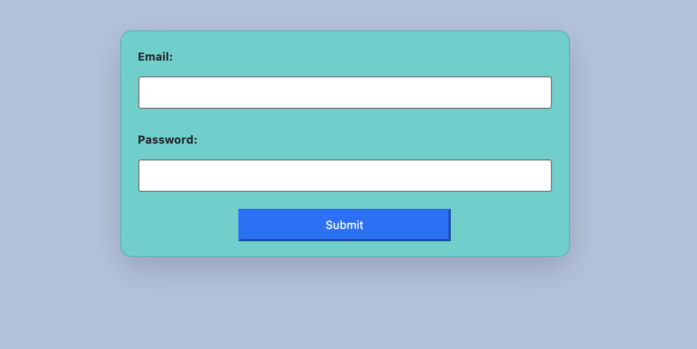

# LoginFormUsingFormik
Login form using Formik with basic validation.

<h2>To use:</h2>
<ul>
<li>Fork this repository</li>
<li>Clone copy to your desktop</li>
<li>Open a command line on your computer and run the command cd path/to/project/root. (path/to/project/root should be replaced with the actual path to the project folder)</li>
<li>Within the same command-line window, run 'npm install' to install all dependencies.</li>
<li>Within the same command-line window, run 'npm start' to start the application in your browser.</li>
  </ul>
<h2>Contributors</h2>
<ul>
  <li>Bill Conley</li>
  <li>Dr. Abel Sanchez</li>
 </ul>
<h2>License</h2>
Copyright (c) 2021 Bill Conley
Permission is hereby granted, free of charge, to any person obtaining a copy
of this software and associated documentation files (the "Software"), to deal
in the Software without restriction, including without limitation the rights
to use, copy, modify, merge, publish, distribute, sublicense, and/or sell
copies of the Software, and to permit persons to whom the Software is
furnished to do so, subject to the following conditions:

The above copyright notice and this permission notice shall be included in all
copies or substantial portions of the Software.

THE SOFTWARE IS PROVIDED "AS IS", WITHOUT WARRANTY OF ANY KIND, EXPRESS OR
IMPLIED, INCLUDING BUT NOT LIMITED TO THE WARRANTIES OF MERCHANTABILITY,
FITNESS FOR A PARTICULAR PURPOSE AND NONINFRINGEMENT. IN NO EVENT SHALL THE
AUTHORS OR COPYRIGHT HOLDERS BE LIABLE FOR ANY CLAIM, DAMAGES OR OTHER
LIABILITY, WHETHER IN AN ACTION OF CONTRACT, TORT OR OTHERWISE, ARISING FROM,
OUT OF OR IN CONNECTION WITH THE SOFTWARE OR THE USE OR OTHER DEALINGS IN THE
SOFTWARE.
